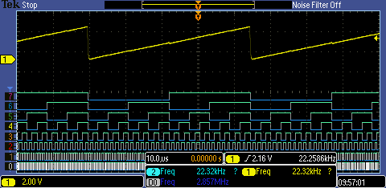
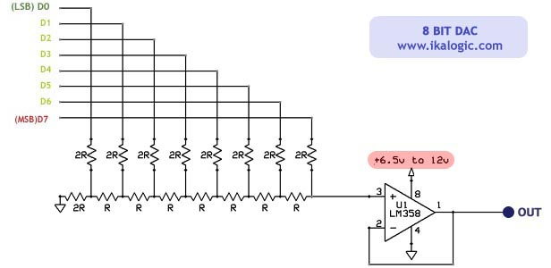

# BBB R2R DAC

uses the PRU to generate a waveform at up to 2MHz.

# Setup

## Electrical connections

first 8 bits of the PRU gpio bus:

* p0 p9_31
* p1 p9_29
* p2 p9_30
* p3 p9_28
* p4 p9_42
* p5 p9_27
* p6 p9_41
* p7 p9_25

connect to the r2r ladder:

Image thanks to [www.ikalogic.com](http://www.ikalogic.com)

* I used 20k and 10k resistors
* I didn't use the opamp buffer.
* [Recommended part](http://uk.farnell.com/bourns/4310r-r2r-103lf/resistor-ladder-n-w-10-10kohm/dp/2112797?ost=bourns+r2r&selectedCategoryId=&categoryNameResp=All%2BCategories&searchView=table&iscrfnonsku=false)

## Software setup

### Disable HDMI to enable loading of PRU overlay

Edit /boot/uEnv, change line 47 to disable HDMI:

    ##Disable HDMI (v3.8.x)
    cape_disable=capemgr.disable_partno=BB-BONELT-HDMI,BB-BONELT-HDMIN

Reboot, and check slots:

    cat /sys/devices/bone_capemgr.9/slots

Showing only last 2 lines:

    5: ff:P-O-- Bone-Black-HDMI,00A0,Texas Instrument,BB-BONELT-HDMI
    6: ff:P-O-- Bone-Black-HDMIN,00A0,Texas Instrument,BB-BONELT-HDMIN

* ff:P-O-- = Disabled
* ff:P-O-L = Enabled

### Build, copy the overlay and add it to slots

    cd overlay
    ./build
    cp EBB-PRU-Example-00A0.dtbo /lib/firmware/
    echo EBB-PRU-Example > /sys/devices/bone_capemgr.9/slots 

There should be no error after the last command.

    cat /sys/devices/bone_capemgr.9/slots

Showing last line:

    7: ff:P-O-L Override Board Name,00A0,Override Manuf,EBB-PRU-Example

### Build and test PRU code

    cd prussC
    ./build

### Generate a datafile

Python code generates a 4000 sample saw tooth

    ./generate_saw.py

### Load the datafile

    ./load_data

Now there should be a 3.3v peak to peak ~640Hz sawtooth waveform on the end of the r2r DAC.

# Project log

more [detailed notes here](log.md)

# Attribution

Many thanks to [excellent resource](http://www.exploringbeaglebone.com/) by
Derek Molloy.

