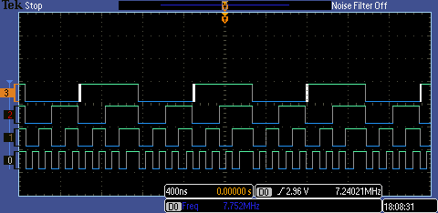
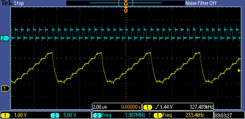

great starting point: http://exploringbeaglebone.com/chapter13/

couldn't load pru cape because:

    [  532.451314] bone-capemgr bone_capemgr.9: slot #8: EBB-PRU-Example conflict P9.28 (#5:BB-BONELT-HDMI)
    [  532.461179] bone-capemgr bone_capemgr.9: slot #8: Failed verification

edit /boot/uEnv to disable HDMI

then works ok:

    echo EBB-PRU-Example > /sys/devices/bone_capemgr.9/slots 
    root@beaglebone:~# cat /sys/devices/bone_capemgr.9/slots 
     0: 54:PF--- 
     1: 55:PF--- 
     2: 56:PF--- 
     3: 57:PF--- 
     4: ff:P-O-L Bone-LT-eMMC-2G,00A0,Texas Instrument,BB-BONE-EMMC-2G
     5: ff:P-O-- Bone-Black-HDMI,00A0,Texas Instrument,BB-BONELT-HDMI
     6: ff:P-O-- Bone-Black-HDMIN,00A0,Texas Instrument,BB-BONELT-HDMIN
     7: ff:P-O-L Override Board Name,00A0,Override Manuf,EBB-PRU-Example

# output signal considerations

20mhz fastest from the PRU. So 8 bit pwm (255 values) means 78khz.

# pru c

got the c compiler for the pru working on bbb. Couldn't find cmd.bin, found it on the internet.

# controlling other gpios

can only control p30.5  (port 9 pin 27). To do with overlays I think. Tried the universal overlay but that doesn't seem to work. Perhaps pru not enabled?

merged this one https://github.com/beagleboard/devicetree-source/blob/master/arch/arm/boot/dts/BB-BONE-PRU-04-00A0.dts

with the overlay in chp13/overlay

# editing and installing overlays:

vim ../overlay/EBB-PRU-Example.dts  (wd: ~/dac/prussC)
./build 
Compiling the overlay from .dts to .dtbo
cp EBB-PRU-Example-00A0.dtbo /lib/firmware/

echo EBB-PRU-Example > /sys/devices/bone_capemgr.9/slots 
echo: write error: File exists

cat /sys/devices/bone_capemgr.9/slots
 0: 54:PF--- 
 1: 55:PF--- 
 2: 56:PF--- 
 3: 57:PF--- 
 4: ff:P-O-L Bone-LT-eMMC-2G,00A0,Texas Instrument,BB-BONE-EMMC-2G
 5: ff:P-O-- Bone-Black-HDMI,00A0,Texas Instrument,BB-BONELT-HDMI
 6: ff:P-O-- Bone-Black-HDMIN,00A0,Texas Instrument,BB-BONELT-HDMIN
11: ff:P-O-L Override Board Name,00A0,Override Manuf,EBB-PRU-Example

echo -11 > /sys/devices/bone_capemgr.9/slots
echo EBB-PRU-Example > /sys/devices/bone_capemgr.9/slots 

# 4 bit counter

got a 4 bit counter working at 7mhz as a proof of concept for DAC control.

# built a resistor ladder network

* http://www.tek.com/blog/tutorial-digital-analog-conversion-%E2%80%93-r-2r-dac
* copied over the shared memory stuff from the pwm example to generate arbitrary waveforms.
* packed the bytes into int and unpacked on the PRU to store 16k samples. 

# pru pins

http://elinux.org/Ti_AM33XX_PRUSSv2#PRU_to_external_peripherals

